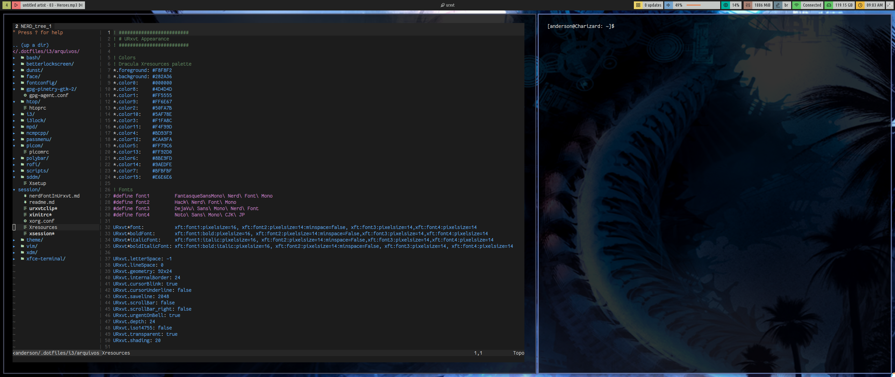

# Instalando NerdFont no URXVT
## Programas
```sh
sudo apt install vim 7zip rxvt-unicode
```
### Primeiro baixe a font desejada, nesse caso a FantasqueSansMono Nerd Font 
```sh
wget https://github.com/ryanoasis/nerd-fonts/releases/download/v2.1.0/FantasqueSansMono.zip
```
### Instale ela
```sh
7z e FantasqueSansMono.zip /home/$USER/.local/share/fonts
fc-cache
```
### Adicione ela no seu .Xdefaults/Xresources e VIMRC
.Xresources ou .Xdefaults
obs.: as outras fonts não precisa instalar se quiser
```sh
#define font1         FantasqueSansMono\ Nerd\ Font\ Mono
#define font2         Hack\ Nerd\ Font\ Mono
#define font3         DejaVu\ Sans\ Mono\ Nerd\ Font
#define font4         Noto\ Sans\ Mono\ CJK\ JP

URxvt*font:           xft:font1:pixelsize=16, xft:font2:pixelsize=14:minspace=false, xft:font3:pixelsize=14,xft:font4:pixelsize=14
URxvt*boldFont:       xft:font1:bold:pixelsize=16, xft:font2:pixelsize=14:minspace=False,xft:font3:pixelsize=14,xft:font4:pixelsize=14
URxvt*italicFont:     xft:font1:italic:pixelsize=16, xft:font2:pixelsize=14:minspace=False,xft:font3:pixelsize=14,xft:font4:pixelsize=14
URxvt*boldItalicFont: xft:font1:bold:italic:pixelsize=16, xft:font2:pixelsize=14:minspace=False, xft:font3:pixelsize=14, xft:font4:pixelsize=14
```
.vimrc
```sh
set guifont=Droid\ Sans\ Mono\ for\ Powerline\ Nerd\ Font\ Complete:style=Regular:h12
```

Esse será o resultado final:

